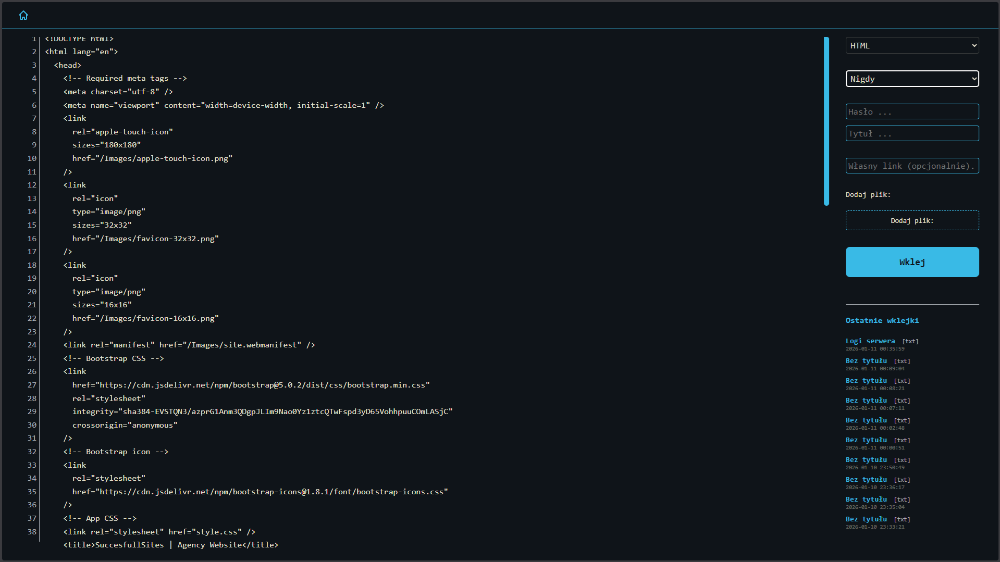
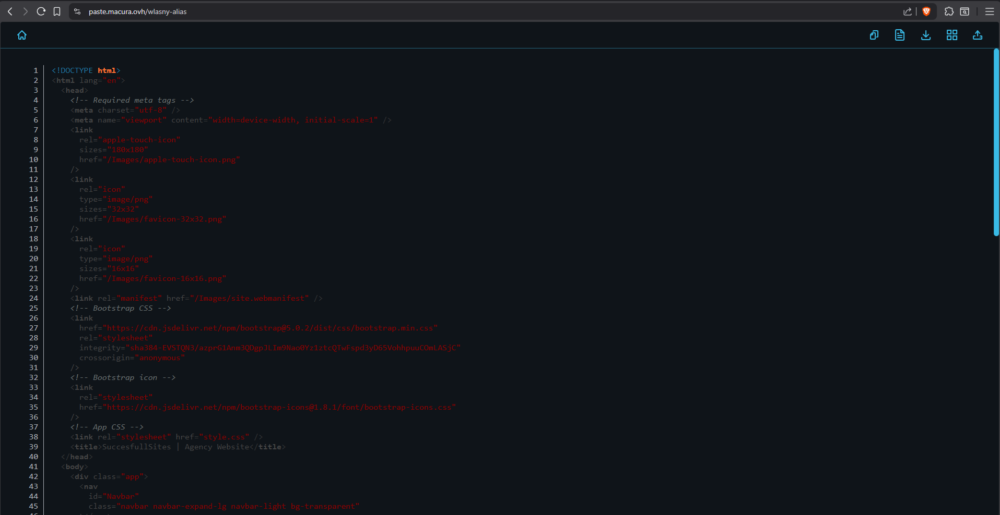
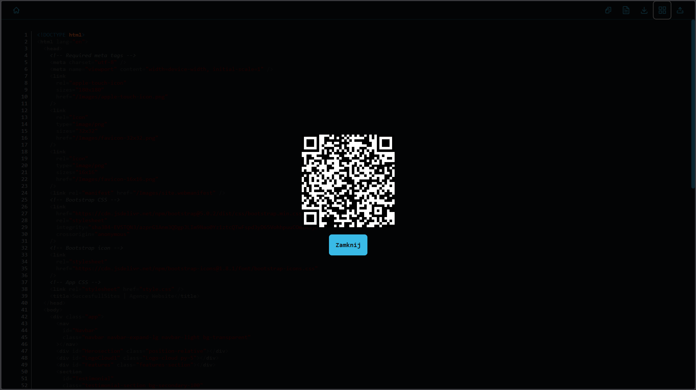
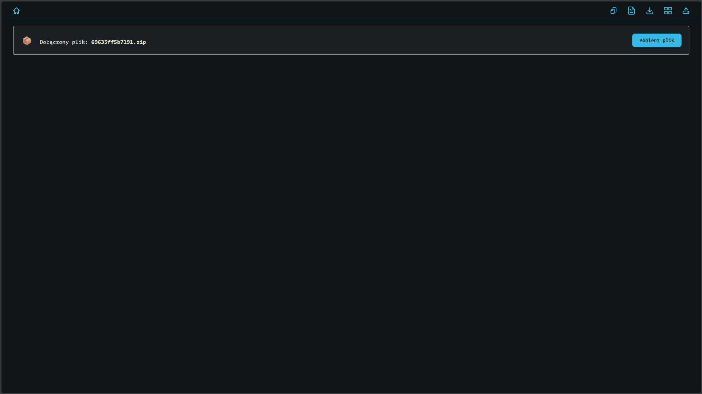
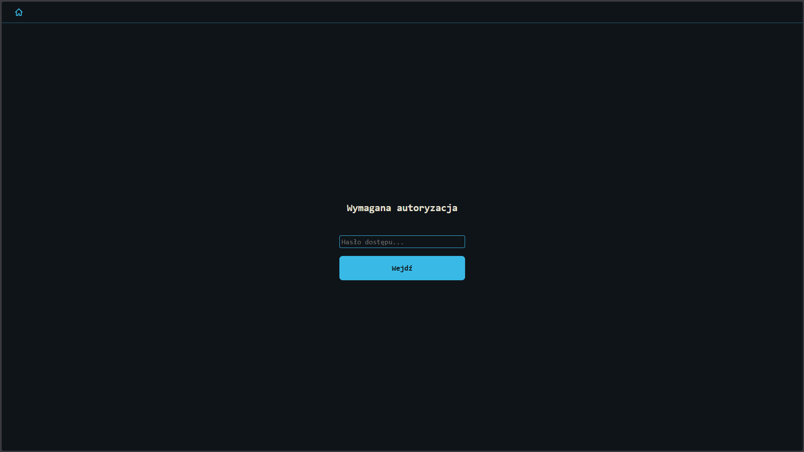

# Paste System


**Paste System** to nowoczesna, wydajna i bezpieczna aplikacja typu Pastebin, zaprojektowana do łatwego udostępniania kodu, plików konfiguracyjnych oraz multimediów. Projekt kładzie nacisk na **prostotę wdrożenia**, **wydajność** (brak ciężkich frameworków) oraz **estetykę** (User Experience).

Aplikacja oferuje bogaty zestaw funkcji, w tym obsługę plików tekstowych i binarnych, kolorowanie składni, mechanizmy samozniszczenia wiadomości (Burn After Reading) oraz zaawansowany panel administracyjny.

---

## 📋 Spis Treści

- [Funkcjonalności](#-funkcjonalności)
- [Galeria](#-galeria)
- [Wymagania Systemowe](#-wymagania-systemowe)
- [Instalacja](#-instalacja)
- [Konfiguracja](#-konfiguracja)
- [Dokumentacja API](#-dokumentacja-api)
- [Panel Administratora](#-panel-administratora)
- [Licencja](#-licencja)

---

## ✨ Funkcjonalności

### Zarządzanie Treścią
*   **Wsparcie Multimediów**: Natywny podgląd dla plików PDF, wideo (MP4, WebM), audio (MP3) oraz obrazów bezpośrednio w przeglądarce.
*   **Edytor Kodu**: Kolorowanie składni (Syntax Highlighting) dla szerokiej gamy języków programowania.
*   **Drag & Drop**: Intuicyjny interfejs umożliwiający przeciąganie plików bezpośrednio do obszaru roboczego.

### Bezpieczeństwo i Prywatność
*   **Burn After Reading**: Opcja tworzenia jednorazowych linków. Dane są trwale usuwane z serwera natychmiast po pierwszym odczycie.
*   **Hasła do Wklejek**: Możliwość zabezpieczenia poszczególnych wpisów indywidualnym hasłem.
*   **Site Password (Tryb Prywatny)**: Globalna blokada dostępu do serwisu, idealna dla wdrożeń wewnątrzfirmowych.

### Personalizacja
*   **Motyw Ayu Dark**: Nowoczesny, ciemny interfejs inspirowany popularnymi motywami IDE, zapewniający komfort pracy.
*   **Custom Slugs**: Możliwość definiowania własnych, czytelnych adresów URL (np. `/projekt-dokumentacja`).
*   **Wygasanie Treści**: Konfigurowalny czas życia wklejki (od 10 minut do bezterminowo).

---

## 📸 Galeria

Poniżej znajdują się zrzuty ekranu prezentujące kluczowe elementy interfejsu aplikacji.

### 1. Interfejs Główny
> *Widok edytora oraz panelu opcji udostępniania.*


### 2. Widok Wklejki
> *Prezentacja udostępnionego kodu z aktywnym kolorowaniem składni.*


### 3. Kod QR
> *Moduł generowania kodów QR dla szybkiego dostępu mobilnego.*


### 4. Podgląd Plików
> *Przykład integracji podglądu multimediów (PDF/Obraz).*


### 5. Ekran Logowania (Site Protection)
> *Formularz autoryzacji przy włączonym trybie `require_auth`.*


### 6. Panel Administratora
> *Centrum zarządzania systemem i wklejkami.*


---

## 💻 Wymagania Systemowe

Aplikacja jest zoptymalizowana do działania na standardowych środowiskach hostingowych.

*   **Serwer WWW**: Apache (z obsługą `mod_rewrite`) lub Nginx.
*   **Interpreter PHP**: Wersja 7.4 lub nowsza.
*   **Baza Danych**: MySQL 5.7+ lub MariaDB.
*   **Rozszerzenia PHP**: `pdo`, `pdo_mysql`.

---

## 🚀 Instalacja

### Krok 1: Pobranie Repozytorium
Sklonuj kod źródłowy do katalogu publicznego serwera WWW:

```bash
git clone https://github.com/twoj-user/paste.git
cd paste
```

### Krok 2: Konfiguracja Bazy Danych
Utwórz nową bazę danych i zaimportuj strukturę tabel z pliku `sql/schema.sql`:

```bash
mysql -u nazwa_uzytkownika -p nazwa_bazy < sql/schema.sql
```

### Krok 3: Uprawnienia Plików
Nadaj uprawnienia do zapisu dla katalogu `uploads`, aby umożliwić przesyłanie plików:

```bash
chmod 755 uploads
```

---

## ⚙️ Konfiguracja

Podstawowa konfiguracja znajduje się w pliku `app/config.php`. Dostosuj parametry do swojego środowiska:

```php
<?php
$config = [
    // Połączenie z Bazą Danych
    'db_host' => 'localhost',
    'db_name' => 'nazwa_bazy',
    'db_user' => 'uzytkownik_db',
    'db_pass' => 'haslo_db',
    
    // Ustawienia Bezpieczeństwa
    'require_auth' => false,       // Wymuszaj logowanie przed dostępem do strony
    'site_password' => 'secret',   // Hasło globalne (dla require_auth)
    'admin_password' => 'adminAC', // Hasło do Panelu Administratora (ZALECANA ZMIANA)
    
    // Inne
    'language' => 'pl'             // Język interfejsu (pl/en)
];
```

---

## 🔌 Dokumentacja API

System udostępnia interfejs REST API, umożliwiający integrację z zewnętrznymi narzędziami oraz automatyzację procesów.

**Endpoint**: `POST /api.php`

### Parametry Żądania

| Parametr | Typ | Wymagalność | Opis |
| :--- | :--- | :--- | :--- |
| `text` | string | **Wymagane** | Główna treść wklejki lub pliku. |
| `title` | string | Opcjonalne | Tytuł wklejki wyświetlany w nagłówku. |
| `extension` | string | Opcjonalne | Rozszerzenie pliku/język składni (np. `php`, `json`). Domyślnie `txt`. |
| `password` | string | Opcjonalne | Hasło dostępowe do konkretnej wklejki. |
| `site_password`| string | Warunkowe* | Hasło globalne serwisu (wymagane, jeśli w `config.php` ustawiono `require_auth`). |
| `burn` | boolean| Opcjonalne | Flaga `1` lub `true`. Aktywuje tryb jednorazowego odczytu. |
| `expires` | integer| Opcjonalne | Czas wygasania w minutach (0 = bezterminowo). |

### Przykłady Użycia

#### Przesyłanie pliku logów (cURL)

```bash
cat server.log | curl -F "text=<-" -F "title=Server Logs" -F "syntax=log" http://twoja-domena.pl/api.php
```

#### Przesyłanie z hasłem i autodestrukcją

```bash
curl -d "text=TajneH" -d site_password="view" -d "burn=1" -d "password=szyfr" http://twoja-domena.pl/api.php
```

---

## � Panel Administratora

Panel dostępny jest pod adresem `/admin.php`. Oferuje następujące możliwości:

1.  **Dashboard**: Przegląd statystyk zużycia miejsca i aktywności użytkowników.
2.  **Lista Wklejek**: Pełna lista aktywnych wpisów z możliwością filtrowania i sortowania.
3.  **Moderacja**: Funkcja trwałego usuwania treści naruszających regulamin.
4.  **Bezpieczeństwo**: Panel chroniony jest niezależnym hasłem zdefiniowanym w konfiguracji.

---

## 📄 Licencja

Projekt dystrybuowany jest na licencji [MIT](LICENSE). Zachęcam do forkowania i współtworzenia projektu.
